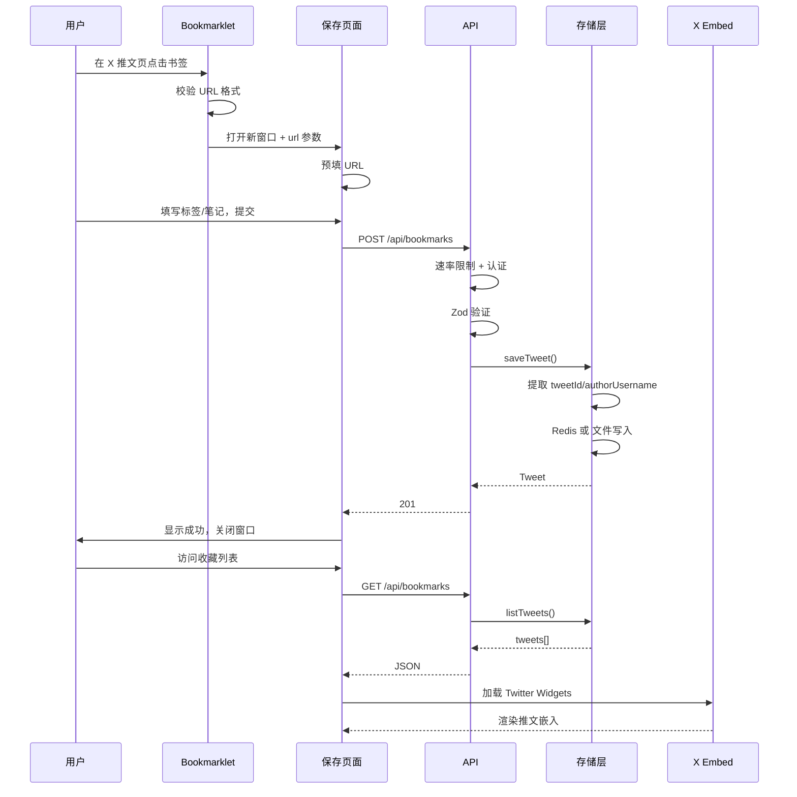
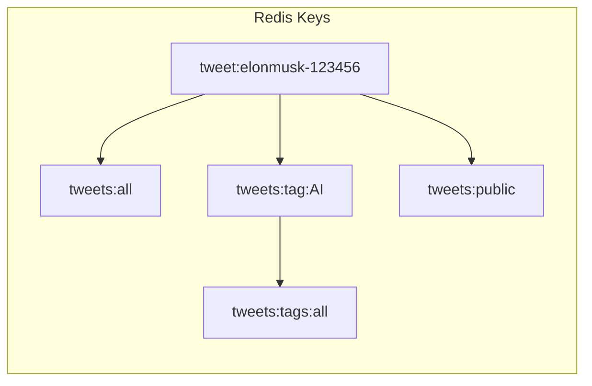
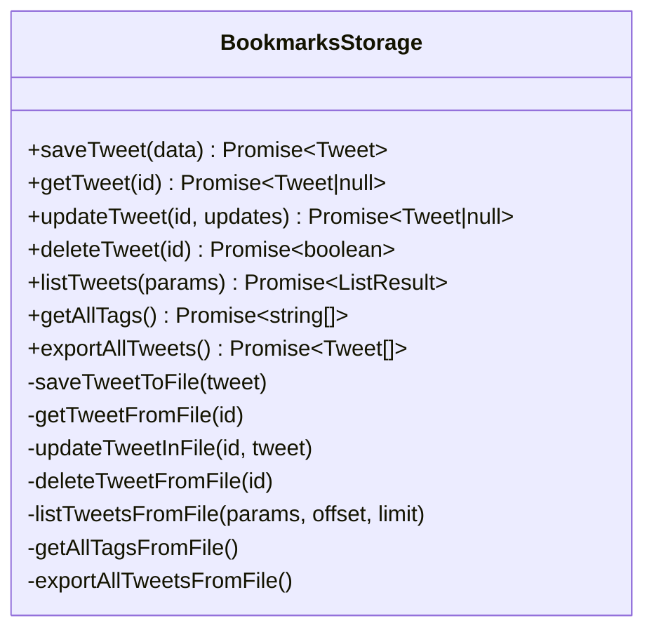
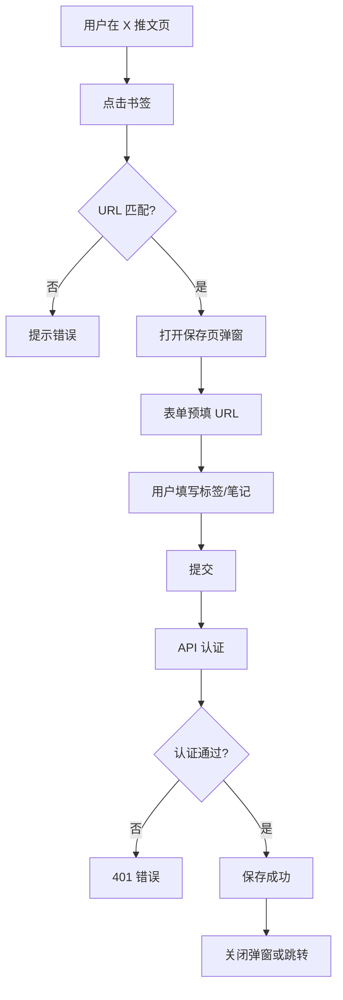
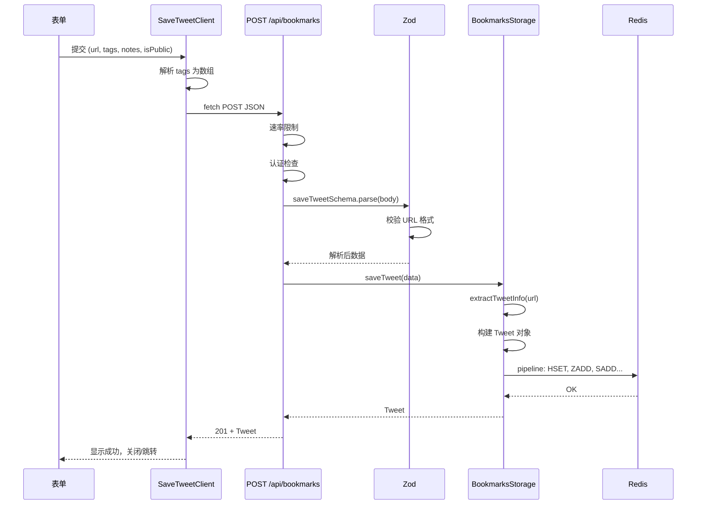

# X 推文收藏功能 - 技术实现文档

> 本文档详细描述集成在 Next.js 15 博客系统中的 X (Twitter) 推文收藏管理功能的完整技术实现。

---

## 目录

1. [功能概述](#1-功能概述)
2. [技术架构](#2-技术架构)
3. [核心模块设计](#3-核心模块设计)
4. [关键交互流程](#4-关键交互流程)
5. [核心代码实现](#5-核心代码实现)
6. [性能优化](#6-性能优化)
7. [安全性设计](#7-安全性设计)
8. [可访问性实现](#8-可访问性实现)
9. [部署和配置](#9-部署和配置)
10. [技术亮点和最佳实践](#10-技术亮点和最佳实践)

---

## 1. 功能概述

### 1.1 功能目标和使用场景

**功能目标**：为博客系统提供一套完整的 X (Twitter) 推文收藏管理能力，使用户能够：

- 从 X 平台快速保存感兴趣的推文到个人博客
- 对收藏的推文进行标签分类和笔记记录
- 选择性公开分享部分收藏
- 通过搜索和筛选高效管理大量收藏
- 导出收藏数据用于备份或迁移

**典型使用场景**：

| 场景 | 描述 |
|------|------|
| 灵感收集 | 开发者在浏览 X 时发现优质技术分享，一键保存到博客 |
| 知识管理 | 为收藏的推文添加标签和笔记，构建个人知识库 |
| 内容分享 | 将精选推文设为公开，在博客上展示给访客 |
| 数据备份 | 定期导出 JSON/Markdown 格式备份收藏数据 |

### 1.2 核心特性列表

| 特性 | 说明 |
|------|------|
| **Bookmarklet 一键保存** | 在 X 推文页面点击书签即可打开保存表单 |
| **标签系统** | 支持多标签、标签筛选、标签自动统计 |
| **笔记功能** | 为每条推文添加个人笔记，支持全文搜索 |
| **公开/私有** | 每条推文可独立设置可见性 |
| **X Embed 展示** | 使用 Twitter Widgets 完整渲染推文（图片、视频） |
| **搜索筛选** | 实时搜索（笔记、标签、推文内容）+ 标签筛选 |
| **导出** | JSON / Markdown 两种格式导出 |
| **双存储模式** | 生产环境 Redis，开发环境 JSON 文件 |

### 1.3 用户价值

- **效率**：Bookmarklet 减少从复制链接到保存的步骤
- **组织**：标签和搜索帮助快速定位收藏
- **分享**：公开收藏可作为博客内容的一部分
- **隐私**：私有收藏仅管理员可见

---

## 2. 技术架构

### 2.1 技术栈

| 层级 | 技术 | 版本/说明 |
|------|------|-----------|
| 前端框架 | Next.js | 15 (App Router) |
| UI 框架 | React | 19 |
| 语言 | TypeScript | 严格模式 |
| 样式 | Tailwind CSS | 3.x |
| 数据验证 | Zod | 3.x |
| 存储 | Upstash Redis | Serverless Redis |
| 外部服务 | X Embed API | 推文嵌入 |

### 2.2 系统架构图

```mermaid
graph TB
    subgraph 前端层 ["前端层 (Frontend)"]
        A1[/bookmarks - 主收藏页]
        A2[/bookmarks/public - 公开页]
        A3[/bookmarks/save - 保存页]
        B1[BookmarksClient]
        B2[PublicBookmarksClient]
        B3[SaveTweetClient]
        C1[TweetCard]
        C2[TweetFilters]
        C3[EditTweetModal]
    end

    subgraph 中间件层 ["中间件 (Middleware)"]
        M1[认证检查]
        M2[路由重定向]
    end

    subgraph API层 ["API 层 (API Routes)"]
        API1[GET/POST /api/bookmarks]
        API2[GET/PATCH/DELETE /api/bookmarks/[id]]
        API3[GET /api/bookmarks/tags]
        API4[GET /api/bookmarks/export]
    end

    subgraph 数据层 ["数据层 (Storage)"]
        subgraph Redis ["Upstash Redis (生产)"]
            R1[tweet:{id}]
            R2[tweets:all]
            R3[tweets:tag:{tag}]
            R4[tweets:public]
            R5[tweets:tags:all]
        end
        subgraph File ["文件存储 (开发)"]
            F1[data/bookmarks.json]
        end
    end

    subgraph 外部服务 ["外部服务"]
        EXT1[X Embed API]
    end

    A1 --> B1
    A2 --> B2
    A3 --> B3
    B1 --> C1
    B1 --> C2
    B1 --> C3
    B2 --> C1
    B2 --> C2

    A1 --> M1
    A2 --> M1
    A3 --> M1
    M1 --> M2

    B1 --> API1
    B1 --> API2
    B2 --> API1
    B3 --> API1
    B1 --> API3
    B1 --> API4

    API1 --> Redis
    API1 --> File
    API2 --> Redis
    API2 --> File
    API3 --> Redis
    API3 --> File
    API4 --> Redis
    API4 --> File

    C1 --> EXT1
```

### 2.3 数据流图



---

## 3. 核心模块设计

### 3.1 数据模型

#### 3.1.1 TypeScript 类型定义（`src/types/bookmarks.d.ts`）

```typescript
// 核心推文实体
export interface Tweet {
  id: string                    // 格式: {authorUsername}-{tweetId}
  url: string                   // 完整推文 URL
  tweetId: string               // X 推文 ID
  authorUsername: string        // 作者用户名
  savedAt: string               // ISO 8601 保存时间
  tags: string[]                // 标签数组
  notes: string                 // 用户笔记
  isPublic: boolean             // 是否公开
  metadata?: {                  // 可选元数据（扩展用）
    authorName?: string
    text?: string
  }
}

// 列表查询参数
export interface TweetListParams {
  page?: number
  limit?: number
  tag?: string
  q?: string
  public?: boolean
}

// 保存请求
export interface SaveTweetRequest {
  url: string
  tags?: string[]
  notes?: string
  isPublic?: boolean
}

// 更新请求
export interface UpdateTweetRequest {
  tags?: string[]
  notes?: string
  isPublic?: boolean
}
```

#### 3.1.2 Zod 验证 Schema（`src/lib/bookmarks-schema.ts`）

```typescript
// 推文 URL 校验：必须是 twitter.com 或 x.com 的 status 链接
export const tweetUrlSchema = z
  .string()
  .url()
  .refine(
    (url) => {
      const match = url.match(/(?:twitter\.com|x\.com)\/(\w+)\/status\/(\d+)/)
      return match !== null
    },
    { message: 'Invalid X/Twitter URL. Must be a tweet status URL.' }
  )

// 保存推文 Schema
export const saveTweetSchema = z.object({
  url: tweetUrlSchema,
  tags: z.array(z.string().min(1).max(50)).max(10).optional().default([]),
  notes: z.string().max(5000).optional().default(''),
  isPublic: z.boolean().optional().default(false),
})

// 列表参数 Schema（支持 coerce 类型转换）
export const tweetListParamsSchema = z.object({
  page: z.coerce.number().int().min(1).optional().default(1),
  limit: z.coerce.number().int().min(1).max(100).optional().default(20),
  tag: z.string().optional(),
  q: z.string().optional(),
  public: z.coerce.boolean().optional(),
})
```

#### 3.1.3 Redis 数据结构设计

| 键 | 类型 | 说明 |
|----|------|------|
| `tweet:{id}` | Hash | 单条推文完整数据，id 格式为 `{authorUsername}-{tweetId}` |
| `tweets:all` | Sorted Set | 所有推文 ID，score 为时间戳，实现按时间倒序 |
| `tweets:tag:{tag}` | Set | 某标签下的推文 ID 集合 |
| `tweets:public` | Set | 公开推文 ID 集合 |
| `tweets:tags:all` | Set | 所有标签集合 |



### 3.2 存储层设计

#### 3.2.1 `BookmarksStorage` 类设计



#### 3.2.2 环境判断逻辑

```typescript
// 判断条件：Vercel 环境 + 已配置 KV_REST_API_URL
const isVercelEnvironment = () => {
  return process.env.VERCEL === '1' && process.env.KV_REST_API_URL
}
```

- **生产环境**：使用 Upstash Redis，支持 Serverless 冷启动
- **开发环境**：使用 `data/bookmarks.json` 文件，无需额外服务

#### 3.2.3 CRUD 操作实现要点

| 操作 | Redis 实现 | 文件实现 |
|------|------------|----------|
| 保存 | `HSET` + `ZADD` + `SADD`（多键） | 读 JSON → 合并 → 写回 |
| 更新 | `HSET` + `SADD`/`SREM` 标签索引 | 读 → 修改 → 写回 |
| 删除 | `DEL` + `ZREM` + `SREM` | 读 → 删除键 → 写回 |
| 列表 | `ZRANGE`/`SMEMBERS` → `HGETALL` pipeline | 读 JSON → 过滤 → 排序 → slice |

### 3.3 API 层设计

#### 3.3.1 RESTful API 设计

| 方法 | 路径 | 认证 | 说明 |
|------|------|------|------|
| GET | `/api/bookmarks` | 公开列表需 `public=true` | 获取推文列表 |
| POST | `/api/bookmarks` | 必需 | 保存新推文 |
| GET | `/api/bookmarks/[id]` | 公开推文无需 | 获取单条推文 |
| PATCH | `/api/bookmarks/[id]` | 必需 | 更新推文 |
| DELETE | `/api/bookmarks/[id]` | 必需 | 删除推文 |
| GET | `/api/bookmarks/tags` | 必需 | 获取所有标签 |
| GET | `/api/bookmarks/export` | 必需 | 导出（JSON/Markdown） |

#### 3.3.2 认证机制

支持三种方式（从 `src/lib/auth.ts`）：

1. **URL 参数**：`?username=xxx&password=xxx` 或 `?auth=base64(username:password)`
2. **Authorization Header**：`Authorization: Basic base64(username:password)`
3. **开发环境**：未配置 `ADMIN_USERNAME`/`ADMIN_PASSWORD` 时自动放行

#### 3.3.3 速率限制

```typescript
// 配置：环境变量或默认值
const bookmarksRateLimit = rateLimit({
  maxRequests: parseInt(process.env.RATE_LIMIT_MAX_REQUESTS || '100'),
  windowMs: parseInt(process.env.RATE_LIMIT_WINDOW_MS || '900000'), // 15 分钟
})
```

- 基于 IP（`x-forwarded-for` 或 `x-real-ip`）
- 超限返回 429

#### 3.3.4 错误处理策略

统一使用 `createErrorResponse` / `createSuccessResponse`：

```typescript
// 成功响应
{ success: true, data: {...}, timestamp: "..." }

// 错误响应
{ error: "message", status: 400, timestamp: "..." }
```

### 3.4 前端组件设计

#### 3.4.1 页面结构

| 路径 | 组件 | 权限 | 说明 |
|------|------|------|------|
| `/bookmarks` | BookmarksClient | 需认证 | 主收藏页，含编辑/删除/导出 |
| `/bookmarks/public` | PublicBookmarksClient | 公开 | 仅展示公开推文 |
| `/bookmarks/save` | SaveTweetClient | 公开 | 保存表单 + Bookmarklet |

#### 3.4.2 核心组件职责

| 组件 | 职责 |
|------|------|
| **TweetCard** | 推文展示（X Embed）、标签、笔记、操作按钮 |
| **TweetFilters** | 搜索框、标签筛选、URL 状态同步 |
| **EditTweetModal** | 编辑标签/笔记/公开状态，弹窗表单 |

#### 3.4.3 状态管理策略

- **服务端状态**：通过 `fetch` 调用 API，无全局状态库
- **URL 状态**：`useSearchParams` 管理 `q`、`tag`、`page`，支持分享和刷新
- **本地状态**：`useState` 管理加载、错误、编辑中的推文

---

## 4. 关键交互流程

### 4.1 Bookmarklet 工作原理

#### 4.1.1 JavaScript 代码分析

```javascript
javascript:(function(){
  const url = window.location.href;
  const match = url.match(/(?:twitter\.com|x\.com)\/\w+\/status\/\d+/);
  if (!match) {
    alert('请在 X (Twitter) 推文页面使用此书签');
    return;
  }
  window.open(
    'https://your-blog.com/bookmarks/save?url=' + encodeURIComponent(url),
    'SaveTweet',
    'width=500,height=700'
  );
})();
```

- **URL 校验**：仅在推文 URL 下执行
- **弹窗**：通过 `window.open` 打开保存页，保留当前 X 页面
- **参数传递**：`url` 参数预填表单

#### 4.1.2 安全性考虑

| 风险 | 缓解措施 |
|------|----------|
| 非推文页面误用 | 正则校验，失败时 alert 提示 |
| URL 注入 | `encodeURIComponent` 编码 |
| 弹窗被拦截 | 用户需允许弹窗；备选手动粘贴链接 |

#### 4.1.3 用户交互流程图



### 4.2 保存推文流程

#### 4.2.1 完整数据流（从用户输入到持久化）



#### 4.2.2 表单验证流程

1. **客户端**：`required` 属性 + 手动解析 tags（逗号分隔）
2. **服务端**：Zod `saveTweetSchema` 校验 URL、tags 长度、notes 长度

#### 4.2.3 API 请求/响应处理

```typescript
// 请求
const response = await fetch('/api/bookmarks', {
  method: 'POST',
  headers: { 'Content-Type': 'application/json' },
  body: JSON.stringify({ url, tags: tagArray, notes, isPublic }),
})

// 响应解析（兼容 data 包装）
const result = await response.json()
const data = result.data || result
```

### 4.3 搜索和筛选

#### 4.3.1 实时搜索实现

- 使用 `use-debounce` 的 `useDebouncedCallback`，500ms 防抖
- 输入变化 → 防抖 → 更新 URL `?q=xxx`
- `useEffect` 依赖 `searchParams` 触发数据重新拉取

```typescript
const debouncedSearch = useDebouncedCallback((value: string) => {
  const params = new URLSearchParams(searchParams.toString())
  if (value) params.set('q', value)
  else params.delete('q')
  params.delete('page')
  router.push(`/bookmarks?${params.toString()}`)
}, 500)
```

#### 4.3.2 标签筛选逻辑

- 服务端：`listTweets({ tag: 'xxx' })` 使用 `tweets:tag:{tag}` 集合
- 客户端：点击标签切换 `?tag=xxx`，再次点击同一标签则清除

#### 4.3.3 URL 状态同步

- `TweetFilters` 的 `searchQuery` 通过 `useEffect` 与 `searchParams.get('q')` 同步
- 支持浏览器前进/后退、直接分享链接

---

## 5. 核心代码实现

### 5.1 数据提取和验证

```typescript
// extractTweetInfo - 从 URL 提取 tweetId 和 authorUsername
export function extractTweetInfo(url: string): {
  tweetId: string
  authorUsername: string
} | null {
  const match = url.match(/(?:twitter\.com|x\.com)\/(\w+)\/status\/(\d+)/)
  if (!match) return null

  return {
    authorUsername: match[1],
    tweetId: match[2],
  }
}

// 使用示例（在 saveTweet 中）
const tweetInfo = extractTweetInfo(data.url)
if (!tweetInfo) {
  throw new Error('Invalid tweet URL')
}
const id = `${tweetInfo.authorUsername}-${tweetInfo.tweetId}`
```

### 5.2 Redis 存储操作（Pipeline 优化）

```typescript
// saveTweet - 使用 pipeline 批量执行
if (isVercelEnvironment()) {
  const pipeline = redis.pipeline()

  pipeline.hset(KEYS.tweet(id), tweet as unknown as Record<string, unknown>)
  pipeline.zadd(KEYS.tweetsAll, { score: Date.now(), member: id })

  if (data.isPublic) {
    pipeline.sadd(KEYS.tweetsPublic, id)
  }

  data.tags.forEach((tag) => {
    pipeline.sadd(KEYS.tweetsTag(tag), id)
    pipeline.sadd(KEYS.allTags, tag)
  })

  await pipeline.exec()
}
```

### 5.3 API 路由实现

```typescript
// POST /api/bookmarks - 保存推文
export async function POST(request: NextRequest) {
  const rateLimitResult = bookmarksRateLimit(request)
  if (!rateLimitResult.allowed) {
    return createErrorResponse('Rate limit exceeded', 429)
  }

  if (!hasAdminAccess(request)) {
    return createErrorResponse('Unauthorized', 401)
  }

  try {
    const body = await request.json()
    const data = saveTweetSchema.parse(body)

    const tweet = await bookmarksStorage.saveTweet(data)

    return createSuccessResponse(tweet, 201)
  } catch (error) {
    if (error instanceof Error) {
      return createErrorResponse(error.message, 400)
    }
    return createErrorResponse('Failed to save bookmark', 500)
  }
}
```

### 5.4 Bookmarklet 实现

```javascript
// 完整 Bookmarklet 代码（SaveTweetClient 中动态生成）
const bookmarkletCode = `javascript:(function(){
  const url=window.location.href;
  const match=url.match(/(?:twitter\\.com|x\\.com)\\/\\w+\\/status\\/\\d+/);
  if(!match){
    alert('请在 X (Twitter) 推文页面使用此书签');
    return;
  }
  window.open(
    '${typeof window !== 'undefined' ? window.location.origin : 'https://talljack.me'}/bookmarks/save?url='+
    encodeURIComponent(url),
    'SaveTweet',
    'width=500,height=700'
  );
})();`
```

### 5.5 React 组件关键逻辑

#### TweetCard - X Embed 集成

```typescript
useEffect(() => {
  if (typeof window !== 'undefined' && tweetRef.current) {
    const script = document.createElement('script')
    script.src = 'https://platform.twitter.com/widgets.js'
    script.async = true
    script.charset = 'utf-8'

    if (!document.querySelector('script[src*="platform.twitter.com"]')) {
      document.body.appendChild(script)
    } else {
      if (window.twttr?.widgets) {
        window.twttr.widgets.load(tweetRef.current)
      }
    }
  }
}, [tweet.url])

// 渲染
<blockquote className="twitter-tweet" data-theme="light">
  <a href={tweet.url}></a>
</blockquote>
```

#### EditTweetModal - 状态管理

```typescript
const [tags, setTags] = useState(tweet.tags.join(', '))
const [notes, setNotes] = useState(tweet.notes)
const [isPublic, setIsPublic] = useState(tweet.isPublic)
const [saving, setSaving] = useState(false)
const [error, setError] = useState<string | null>(null)

// ESC 关闭
useEffect(() => {
  const handleEscape = (e: KeyboardEvent) => {
    if (e.key === 'Escape') onClose()
  }
  document.addEventListener('keydown', handleEscape)
  return () => document.removeEventListener('keydown', handleEscape)
}, [onClose])

// 提交时解析 tags
const tagArray = tags.split(',').map((t) => t.trim()).filter((t) => t.length > 0)
await onSave(tweet.id, { tags: tagArray, notes, isPublic })
```

---

## 6. 性能优化

### 6.1 Redis Pipeline 使用

- 所有多键操作（save、update、delete、list、export）均使用 `pipeline.exec()`
- 减少网络往返次数，提高吞吐量

### 6.2 React 19 并发特性

- 使用 `Suspense` 包裹 `BookmarksClient`，提供加载状态
- 客户端组件按需加载，减少首屏阻塞

### 6.3 静态生成优化

- 收藏页面为客户端渲染，数据通过 API 获取
- 公开页面 `/bookmarks/public` 同样采用 CSR，便于实时更新

### 6.4 客户端缓存策略

- API 响应头：`Cache-Control: public, max-age=60, s-maxage=60`
- 搜索使用防抖，减少无效请求

---

## 7. 安全性设计

### 7.1 输入验证（Zod）

| 字段 | 校验规则 |
|------|----------|
| url | 合法 URL + 推文格式正则 |
| tags | 每个标签 1–50 字符，最多 10 个 |
| notes | 最多 5000 字符 |
| isPublic | 布尔值 |

### 7.2 XSS 防护

- React 默认转义文本内容
- 导出场景中，Markdown 生成使用字符串拼接，不直接插入用户 HTML

### 7.3 CSRF 保护

- 使用 Same-Origin + Cookie 策略
- 敏感操作需认证，无状态 API 不依赖 Cookie

### 7.4 认证机制

- 管理员凭据通过环境变量配置
- 支持 Basic Auth 和 URL 参数（生产环境建议仅用 Header）

### 7.5 速率限制

- 基于 IP 的限流，防止滥用
- 默认 100 次/15 分钟，可配置

---

## 8. 可访问性实现

### 8.1 WCAG 2.1 AA 合规性

| 要求 | 实现 |
|------|------|
| 表单标签 | 所有 input 关联 `<label>`，搜索框使用 `sr-only` |
| 焦点状态 | `focus-visible:ring-2 focus-visible:ring-blue-500` |
| 触摸目标 | 按钮 `min-h-[44px] min-w-[44px]` 满足 44×44px |

### 8.2 ARIA 标签

```typescript
// 搜索框
<label htmlFor="bookmark-search" className="sr-only">搜索推文、标签或笔记</label>
<input id="bookmark-search" aria-label="搜索推文、标签或笔记" ... />

// 编辑按钮
<button aria-label={`编辑推文 @${tweet.authorUsername}`}>编辑</button>

// 模态框
<div role="dialog" aria-modal="true" aria-labelledby="edit-modal-title">
```

### 8.3 键盘导航

- EditTweetModal 支持 ESC 关闭
- 焦点陷阱（可选，可用 Radix 等库增强）

### 8.4 触摸目标大小

- 编辑/删除按钮：`min-h-[44px] px-4 py-2 -m-2`
- 标签按钮：`min-h-[44px] px-4 py-2.5`
- 关闭按钮：`min-h-[44px] min-w-[44px]`

### 8.5 颜色对比度

- 使用 `text-gray-700`、`text-gray-600` 避免 gray-500 对比度不足
- 深色模式适配

---

## 9. 部署和配置

### 9.1 环境变量配置

```env
# 管理员认证（生产必需）
ADMIN_USERNAME=your_username
ADMIN_PASSWORD=your_password

# Upstash Redis（生产必需）
KV_REST_API_URL=https://xxx.upstash.io
KV_REST_API_TOKEN=your_token

# 速率限制（可选）
RATE_LIMIT_MAX_REQUESTS=100
RATE_LIMIT_WINDOW_MS=900000

# 站点 URL（Bookmarklet 用）
NEXT_PUBLIC_SITE_URL=https://your-blog.com
```

### 9.2 Upstash Redis 设置

1. 在 [Upstash Console](https://console.upstash.com) 创建 Redis 数据库
2. 复制 REST URL 和 Token 到环境变量
3. 确保 Vercel 项目已绑定上述变量

### 9.3 生产环境优化建议

| 建议 | 说明 |
|------|------|
| 分布式限流 | 使用 Upstash Redis 实现跨实例限流 |
| 禁用 URL 认证 | 生产环境仅使用 Authorization Header |
| 备份 | 定期导出 JSON 备份 |
| 监控 | 监控 API 错误率和延迟 |

---

## 10. 技术亮点和最佳实践

### 10.1 双存储模式设计

- 同一套 `BookmarksStorage` 接口，根据环境自动切换 Redis 或文件
- 开发无需 Redis，降低本地开发成本

### 10.2 类型安全的 API 设计

- Zod 保证请求/响应结构
- TypeScript 类型贯穿前后端

### 10.3 可访问性优先

- 语义化 HTML、ARIA、键盘支持、触摸目标
- 符合 WCAG 2.1 AA 要求

### 10.4 渐进增强策略

- 无 JS 时表单仍可提交（需后端渲染）
- 有 JS 时提供 Bookmarklet、实时搜索等增强体验

### 10.5 其他实践

- 使用 `use-debounce` 优化搜索
- 统一错误响应格式
- 中间件集中处理认证和重定向

---

## 相关资源和参考

- [Next.js 15 文档](https://nextjs.org/docs)
- [Upstash Redis](https://upstash.com/docs/redis)
- [Zod 文档](https://zod.dev)
- [X Embed 文档](https://developer.x.com/en/docs/twitter-for-websites/embedded-tweets/overview)
- [WCAG 2.1 指南](https://www.w3.org/WAI/WCAG21/quickref/)
